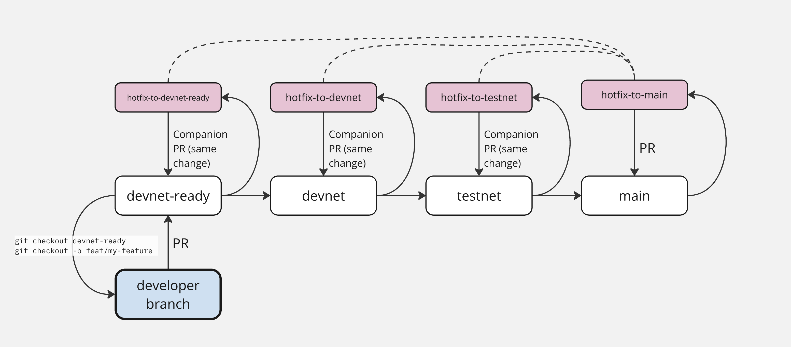

# Subtensor Contributor Guide

## Lifecycle of a Pull Request

1. Individuals wishing to contribute to subtensor should develop their change/feature/fix based on 
   the `devnet-ready` branch and create a [Pull Request](https://github.com/opentensor/subtensor/compare) 
   (PR) targeting the `devnet-ready` branch of the subtensor GitHub repository. It is recommended 
   to start your pull request as a draft initially until you are ready to have other developers 
   actively look at it. Any changes to pallet/runtime code should be accompanied by integration 
   and/or unit tests fully testing all the edge cases of this functionality, if applicable.
2. Once you have finished developing your change/feature/fix and the Rust portion of the CI is
   passing for your PR (everything prefixed with "CI"), you should mark your PR as "Ready for
   Review" and request review from "Nucleus".
3. Core Nucleus team members will review your PR, possibly requesting changes, and will also
   add appropriate labels to your PR as shown below. Three positive reviews are required.
4. Once the required passing reviews have been obtained, you or an administrator may merge the
   PR into the `devnet-ready` branch.
5. At some point, a core team administrator will open a PR merging the current `devnet-ready`
   branch into `devnet`, and the CI will enforce some additional safety checks on this PR
   including a requirement that the new `spec_version` be greater than the current on-chain
   `spec_version`. The PR should include a bulleted list of all PRs included in the deploy so
   they can be easily found after the fact.
6. Once your feature/change/fix is on `devnet`, it is your responsibility to confirm it is
   working properly. If it is not working and additional changes are needed, please coordinate
   with a core team administrator and/or open up a new PR into `devnet` either reverting your
   changes or making any required changes in order for the feature to function properly.
7.  On the appropriate date, an administrator will open a PR merging the current `devnet`
    branch into `testnet`. This PR should include a bulleted list of all PRs included in the
    deploy so they can be easily found after the fact (TODO: automate this). This PR is merged,
   the administrator will deploy `testnet` and cut a (pre-release) release in GitHub for
    `testnet` (TODO: github action to generate the release and release notes).
11. It is now your responsibility to once again check that your feature/change/fix is working
    properly, this time on `testnet`. Once again if it is not working or additional changes are
    needed, please coordinate with a core team administrator ASAP and/or open up a new PR into
    `testnet` either reverting your changes or making any required changes in order for the
    feature to function properly.
12. At some point the administrator will merge current `testnet` into `main` and cut a new
    deploy to mainnet/finney.

## PR Labels

| Name  | Description | Automations |
| ----- | ----------- | ----------- |
| `red-team` | PR is focused on feature additions/changes | none |
| `blue-team` | PR is focused on preventative/safety measures and/or dev UX improvements | none |
| `runtime` | PR contains substantive changes to runtime / pallet code | none |
| `breaking-change` | PR requires synchronized changes with bittensor | Triggers an automatic bot message so the relevant teams are made aware of the change well in advance |

## Branches

### `devnet-ready`

All new feature/change/fix PRs should merge into this branch.

#### Restrictions
* no deleting the branch
* no force pushes
* no direct pushes
* require 3 positive review from an administrator
* new code changes do _not_ invalidate existing reviews
* only merge commit style merging allowed

#### CI-Enforced Restrictions
* `check-rust.yml` must pass

### `devnet`

Tracks the current state of what is deployed to `devnet`. Modified by an administrator via a PR
merging `devnet-ready` into `devnet`, in concert with a deploy of `devnet`.

#### Restrictions
* no deleting the branch
* no force pushes
* no direct pushes
* require 2 positive reviews from core team members
* new code changes invalidate existing reviews
* only merge commit style merging allowed

#### CI-Enforced Restrictions
* `check-rust.yml` must pass
* `check-devnet.yml` must pass
* spec_version must be greater than what is currently on live `devnet`
* TODO: other pre-deploy sanity checks here

### `testnet`

Tracks the current state of what is deployed to `testnet`. Administrator will open a PR merging
current `devnet` into `testnet` and merge it in concert with a deploy to `testnet`. Contains
tags for `testnet` releases.

#### Restrictions
* no deleting the branch
* no force pushes
* no direct pushes
* require 2 positive reviews from core team members
* new code changes invalidate existing reviews
* only merge commit style merging allowed

#### CI-Enforced Restrictions
* `check-rust.yml` must pass
* `check-testnet.yml` must pass
* spec_version must be greater than what is currently on live `testnet`
* TODO: other pre-deploy sanity checks here

### `main`

Tracks the current state of what is deployed to `finney` (mainnet). Updated via an
administrator-submitted PR merging `testnet` into `main` in concert with a `finney` deploy.

#### Restrictions
* no deleting the branch
* no force pushes
* no direct pushes
* require 3 positive reviews from core team members
* new code changes invalidate existing reviews
* only merge commit style merging allowed

#### CI-Enforced Restrictions
* `check-rust.yml` must pass
* `check-finney.yml` must pass
* `spec_version` must be greater than what is currently on live `finney`
* TODO: other pre-deploy sanity checks here
