## Yuma Consensus

Bittensor uses a dual proof-of-stake, proof-of-work mechanism called Yuma Consensus which rewards validators with scoring incentive for producing evaluations of miner-value which are in agreement with the subjective evaluations produced by other validators weighted by stake. Servers receive incentive for their share of the utility according to the validator consensus.

### Problem definition

> How do we automatically detect and penalize reward manipulation in high-volume subjective utility networks?

Most utility networks serve objectively measurable utility, such as data storage (Filecoin, Siacoin, Storj, Arweave), computation (Golem, TrueBit, Flux, Render, iExec RLC, Near), wireless networking (Helium), video streaming (Theta, Livepeer), and music streaming (Audius). Each of these networks employs specific, quantifiable metrics for their services, ranging from gigabytes of storage and CPU/GPU cycles to network coverage, bandwidth utilization and streaming quality.

Objectively measurable utility makes it easy to detect and penalize reward manipulation, without the need for sophisticated consensus. Cryptographic proofs verify storage claims (Filecoin, Siacoin), outlier detection identifies and isolates inaccurate assessments (Ocean), cross-validation by multiple independent oracles reduce impact of single dishonest oracle (Chainlink), redundant computation prevents false result validation (Golem, TrueBit), random checks and challenges ensure honesty in computation results evaluation (iExec RLC), and continuous verification of actual network coverage (Helium). Objective utility networks typically need only basic majority consensus to correct malicious validation.

Subjective utility networks (such as Steemit, Hive, LBRY, Minds, Voice, etc.) typically revolve around community-generated and curated content. Lower-volume content production allows for manual voting and tipping by users, or measurements of user and viewer engagement to calculate rewards.
These subjective utility networks predominantly rely on manual mechanisms for reward distribution and detection of malicious activity. Community-driven reporting and moderation (Steemit, Hive, Minds), manual content evaluation (LBRY, Voice), and real identity verification (Voice) deter and penalize reward manipulation.

Community oversight (as in Steemit) must identify wrongful downvoting, but only indirect remediation via counter-voting can penalize bad actors. The absence of voting reputation means users can only downvote the content of bad actors as retribution and thereby only damage content reputation, because no automated penalty mechanism exists. Similarly, users can upvote their own content and potentially receive nominal reward according to their stake, so reward manipulation may go unchecked.

High-volume, on-demand generative content (as in Bittensor) demands automated evaluation and divide-and-conquer validation, but introduces subjectivity both in the automated value measures and mutually exclusive task subsets across validators. A coalition of validators can collude to skew scoring of servers in their favour, which is harder to detect because of the inherent subjectivity. Existing consensus mechanisms will fail to deter reward manipulation for such high-volume subjective utility networks, so the need for a more sophisticated consensus arises.

### Consensus Mechanism

Yuma Consensus guarantees long-term network honesty despite persistent adversarial presence in high-volume subjective utility networks. It directly penalizes selfish scoring by down-correction to the majority consensus and slashing of cabal voting stake, and also penalizes low-scoring of honest servers via forfeited validator rewards when cabals don’t score at consensus.

Yuma Consensus is adversarially-resilient when majority stake is honest, via stake-based median scoring that punishes selfish weighting by minority stake (cabal). We clip excess weight above the maximum weight supported by at least $\kappa$-majority stake, which ensures selfish weighting is corrected and reduces voting stake of cabal validators via bonds penalty $\beta$.

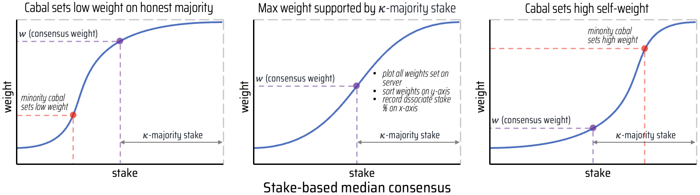

**Max weight supported by $\kappa$-majority stake**: We can plot a consensus graph for each active miner by ordering weights (y-axis) set on the target miner and recording cumulative stake (x-axis) of the source validators. The weight read at $x=1-\kappa$ ratio of total active stake is the stake-based median, which means that at least $\kappa$ stake supports that weight decision. Typically $\kappa=0.5$, which means that 50% of stake needs to agree on the relative utility of a miner, and we clip excess weight above this median to encourage validators to vote fairly and uphold consensus.

**Cabal sets low weight on honest majority**: The median calculation ignores selfish subsets that vote dishonestly (cabals), if they have minority stake (less than $\kappa$-majority), when they set low weights on the honest majority. This means that a minority cabal cannot negatively influence the consensus weight on honest servers.

**Cabal sets high self-weight**: Cabal servers with poor utility will receive low weights from majority stake, and high self-weight from minority cabals will then get reduced to the low consensus. This means that minority cabals lose voting power as penalty for unfair voting while still receiving low consensus weight despite high self-weight. This consensus mechanism thus protects against selfish weighting if the majority stake is honest.

### Game-theoretic framework

#### Preliminaries
We consider a two-team game between (protagonist) honest stake ($0.5< S_H\le 1$) and (adversarial) cabal stake ($1 - S_H$), with $|H|$ honest and $|C|$ cabal players, that have $S_H = \sum_{i\in H}S_i$ honest stake and $1-S_H = \sum_{i\in C}S_i$ cabal stake. They compete for total fixed reward $E_H + E_C = 1$, with honest emission $E_H$ and cabal emission $E_C$, respectively, followed by stake updates $S_H'=\frac{S_H+E_H}{2}$ and $S_C'=\frac{1 - S_H+E_C}{2}$. The honest objective $S_H\le E_H$ at least retains scoring power $S_H$ over all action transitions in the game, otherwise when $E_H\le S_H$ honest emission will erode to 0 over time, despite a starting condition of $0.5\lt S_H$.

We assume honest stake sets objectively correct weights $W_H$ on itself, and $1 - W_H$ on the cabal, where honest weight $W_H$ represents an ongoing expense of the honest player such as utility production, sustained throughout the game. However, cabal stake has an action policy that freely sets weight $W_C$ on itself, and $1 - W_C$ on the honest player, at no cost to the cabal player.
Specifically, honest players $i\in H$ set $W_H = \sum_{j\in H}W_{ij}$ self-weight and $1-W_H = \sum_{j\in C}W_{ij}$ weight on cabal players, while cabal players $i\in C$ set $W_C = \sum_{j\in C}W_{ij}$ self-weight and $1-W_C = \sum_{j\in H}W_{ij}$ weight on honest players.

The cabal has the objective to maximize the required honest self-weight expense $W_H$ via
$$W_C^*=\arg\max_{W_C}E[W_H\;|\;S_H=E_H(S_H,W_H,W_C)].$$

We then assume the honest majority $S_H>0.5$ can counter with a consensus policy $\pi$ allowed to modify all weights modulo player labels, so it is purely based on the anonymous weight distribution itself, optimizing the Nash equilibrium
$$\min_{\pi}\max_{W_C}E[W_H\;|\;S_H=E_H(S_H,\pi(\mathbf{W}))].$$

#### Consensus policy
Majority stake enforces an independent and anonymous consensus policy $\pi$ (through a blockchain solution) that modifies the weights to minimize the expense $W_H$, which has been maximized by the cabal applying an objectively incorrect gratis self-weight $W_C$. Consensus aims to produce $\pi(\mathbf{W})\rightarrow (W'_H, W'_C)$ so that $W'_C=1-W'_H$, by correcting the error $\epsilon=W_C+W_H-1>0$. Note that the input cost $W_H$ remains fully expensed, and that $W'_H$ merely modifies the reward distribution that follows, but not knowing which players are honest or cabal (anonymous property).

We propose a consensus policy that uses stake-based median as consensus weight $\overline{W_j}$, so that $\kappa$-stake (typically majority, i.e. $\kappa\ge 0.5$) decides the maximum supported weight on each server $j$.
The indicator function $\left\{ W_{ij} \ge w \right\}$ adds stake $S_i$ if validator $i$ supports a specific weight-level $w$ on server $j$.
$$\overline{W_j}=\arg \max_w \left( \sum_i S_i \cdot \left\{ W_{ij} \ge w \right\} \ge \kappa \right)$$

The consensus policy applies weight correction $\overline{W_{ij}} = \min( W_{ij}, \overline{W_j} )$ to weight excess above consensus, which (i) restricts server incentive in case of selfish weighting, and (ii) penalizes selfish validators by slashing their voting stake (bonds) and validation rewards.
The bonds penalty $\beta$ controls the degree to which weights for bonds are cut above consensus, which decides the penalty against validator rewards.
$$\widetilde{W_{ij}} = (1-\beta) \cdot W_{ij} + \beta \cdot \overline{W_{ij}}$$

#### Reward distribution
Emission ratio $\xi$ decides the ratio of emission for validation rewards, and $1-\xi$ the ratio for server incentive, typically $\xi=0.5$. 
$$E_i = \xi \cdot D_i + (1-\xi) \cdot I_i$$

Server incentive $I_j = R_j / \sum_k R_k$ is normalized server rank $R_j = \sum_i S_i \cdot \overline{W_{ij}}$ (sum of consensus-clipped weighted stake).

Validation reward $D_i = \sum_j B_{ij} \cdot I_j$ is the product of the validator's bond with server $j$ and server $j$ incentive, where the bond is the normalized bonds penalty clipped weighted stake.
$$B_{ij} = S_i \cdot \widetilde{W_{ij}} \left/ \left( \sum_k S_k \cdot \widetilde{W_{kj}} \right) \right.$$

#### Mathematical definitions
| Variable | Equation | Description |
| - | - | - |
| Weight | $W_{ij}$ | Validator $i$ weight on server $j$. |
| Stake | $S_i = S'_i / \sum_k S'_k$ | Validator $i$ relative stake. |
| Server prerank | $P_j = \sum_i S_i \cdot W_{ij}$ | Sum of weighted stake. |
| Server consensus weight | $\overline{W_j} = \arg \max_w \left( \sum_i S_i \cdot \left\{ W_{ij} \ge w \right\} \ge \kappa \right)$ | $\kappa$-stake supported maximum weight on server $j$. |
| Consensus-clipped weight | $\overline{W_{ij}} = \min( W_{ij}, \overline{W_j} )$ | Validator $i$ consensus-clipped weight on server $j$. |
| Server rank | $R_j = \sum_i S_i \cdot \overline{W_{ij}}$ | Sum of consensus-clipped weighted stake. |
| Server incentive | $I_j = R_j / \sum_k R_k$ | Ratio of incentive for server $j$. |
| Server trust | $T_j = R_j / P_j$ | Relative server weight remaining after consensus-clip. |
| Validator trust | $T_{vi} =  \sum_j \overline{W_{ij}}$ | Relative validator weight remaining after consensus-clip. |
| Bonds penalty | $\beta \in [0, 1]$ | Degree to cut bonds above consensus weight. |
| Weight for bonds | $\widetilde{W_{ij}} = (1-\beta) \cdot W_{ij} + \beta \cdot \overline{W_{ij}}$ | Apply bonds penalty to weights. |
| Validator bond | $B_{ij} = S_i \cdot \widetilde{W_{ij}} \left/ \left( \sum_k S_k \cdot \widetilde{W_{kj}} \right) \right.$ | Validator $i$ bond with server $j$. |
| Validator reward | $D_i = \sum_j B_{ij} \cdot I_j$ | Validator $i$ portion of incentive. |
| Emission ratio | $\xi \in [0, 1]$ | Reward/incentive ratio for emission |
| Emission | $E_i = \xi \cdot D_i + (1-\xi) \cdot I_i$ | Emission for node $i$. |

### Consensus guarantees
Yuma Consensus guarantees honest majority stake retention $S_H\le E_H$ even under worst-case adversarial attacks, given sufficiently large honest utility $W_H$. The specific honest stake and utility pairs that delineate the guarantees are complicated by natural variances inside large realistic networks.
Therefore, we use extensive random sampling simulations (Monte Carlo studies) of large realistic networks and subject them to varying degrees of adversarial attacks, and calculate comprehensive consensus guarantees under representative conditions.
Note the primary assumption is that the majority stake is honest, so we use majority/honest interchangeably, same with minority/cabal.


#### Retention graphs
Consensus guarantees are dependent on stake, utility, and validator behaviour, so we use 2D contour plots to comprehensively display guarantees across each possible set of conditions.
The x-axis is major self-weight and the y-axis is minor self-weight, and each contour line is a specific major stake.
Major/honest self-weight $W_H$ is the true honest utility, while minor/cabal self-weight $W_C$ is an arbitrary value a self-serving coalition may self-report.

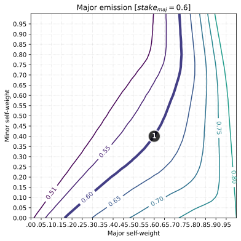
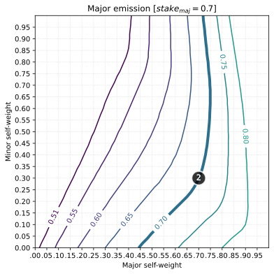
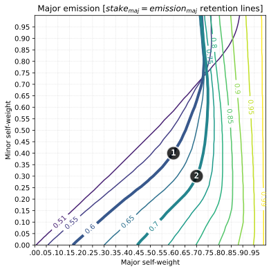

To understand how we construct these plots, let us first consider contour plot for a single major/honest stake setting $S_H=0.6$. Here each contour value is the honest emission $E_H$, and we highlight at (1) the specific contour $E_H=0.6$ that matches the honest stake. This means that any weight setting on contour $E_H=S_H=0.6$ will retain honest stake, while any setting to the right of it will grow honest stake.

Similarly, the specific emission contour plot for $S_H=0.7$, highlights the contour where the emission is $E_H=0.7$, which means with inflation the honest share ratio of $S_H=0.7$ can be retained if honest utility is at least $W_H>0.75$.

A compound plot then combines all the highlighted $S_H=E_H$ contours from individual contour plots (e.g. $S_H=0.6$ and $S_H=0.7$), to show the overall retention profile. Generally, the higher the honest stake, the higher the honest utility requirement to retain stake proportion under adversarial weight setting.

Retention graphs like these comprehensively capture consensus guarantees across all primary conditions, and we utilize these to analyze the effect of consensus hyperparameters.
Subtensor integration tests run Monte Carlo simulations of large realistic networks under adversarial conditions, and constructs retention profiles to confirm consensus guarantees of the actual blockchain implementation.

Retention profiles are reproducible by running [`_map_consensus_guarantees`](../pallets/subtensor/tests/epoch.rs) (decorate with `#[test]`).
```bash
RUST_BACKTRACE=1 SKIP_WASM_BUILD=1 cargo test -- _map_consensus_guarantees --exact --nocapture > consensus.txt
```

#### Subjectivity variance
Yuma Consensus corrects reward manipulation in subjective utility networks, but the extent of subjectivity influences the exact consensus guarantees. In particular, we expect lower subjectivity to offer improved guarantees since there is stronger consensus. However, for higher variance in assigned weights it is easier to hide reward manipulation, we then expect poorer guarantees.

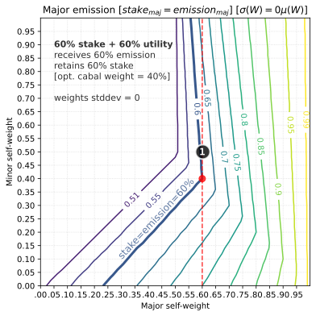
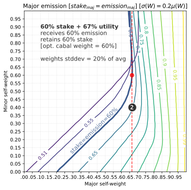
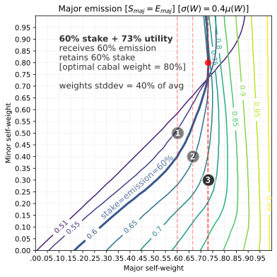

We assume normally distributed weights originating from a particular side, either honest or cabal, then we modify the weight deviation magnitude $\sigma(W)$ in terms of the mean weight $\mu(W)$.
Weight deviations of $\sigma=0\mu$, $0.2\mu$, and $0.4\mu$ respectively require 60%, 67%, and 73% honest utility to preserve 60% honest stake.
This confirms the expectation that higher subjectivity variance demands greater honest utility for honesty preservation.

Bitcoin has its well-known 51% attack, while Yuma Consensus has a 40% stake + 30% utility attack under high subjectivity ($0.4\mu$).
This means that a bad actor with 40% stake that produces 30% utility or more can gain majority stake over time.
In practice, we typically observe standard deviations of $0.2\mu$ to $0.4\mu$, so Yuma Consensus guarantees honest 60% stake retention for ~70% honest utility or more.

#### Majority ratio (κ)
Hyperparameter `Kappa` sets the ratio of stake that decides consensus, with a typical recommended value of $\kappa=0.5$, which means that at least 50% of stake needs to be in consensus on the maximum weight assignable to a specific server.
Reducing $\kappa$ weakens consensus and allows smaller cabals to manipulate rewards, in particular $\kappa=0.4$ demands higher honest utility when $S_H<0.6$ (such as $0.51$ and $0.55$).
Increasing $\kappa$ demands greater honest stake, e.g. when $\kappa=0.6$ there is no protection for $S_H<0.6$ even with $W_H=1$.
Hence $\kappa=0.5$ is typically the most sensible setting.

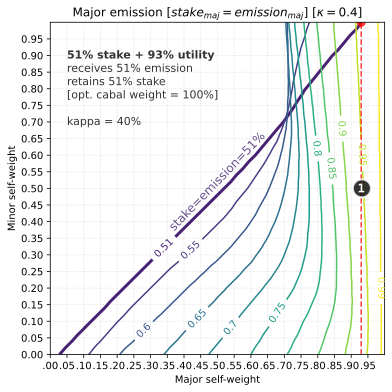
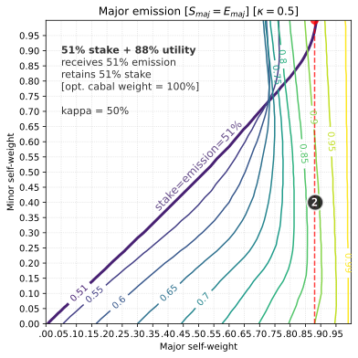
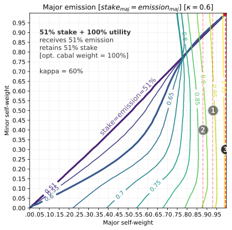

#### Bonds penalty (β)
Yuma Consensus separately adjusts server incentive $I_j$ and validation reward $D_i$ to counter manipulation, where the extent of validation reward correction depends on the bonds penalty $\beta$.
Server incentive is always corrects fully, but validation reward correction is adjustable to control the penalty of out-of-consensus validation.
Lower-stake validators may experience lower service priority, which can result in partial validation, or exploratory validators may skew weighting toward emergent high-utility.
Full bonds penalty $\beta=1$ may not be desired, due to the presence of non-adversarial cases like these.

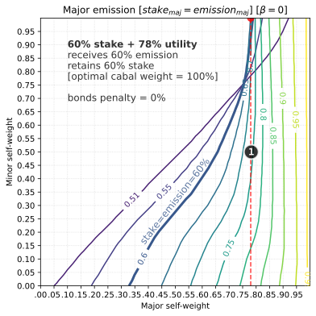
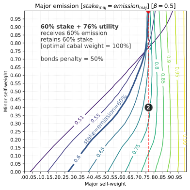
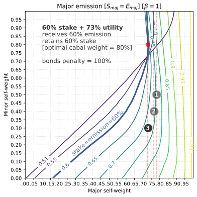

We expect that greater bonds penalty will penalize out-of-consensus validators more, which means less emission going to cabals. Comprehensive simulation with $\beta = 0$, $0.5$, and $1$ respectively show 78%, 76%, and 73% honest utility requirement. This confirms the expectation, that greater bonds penalty means greater inflation going to the honest majority.

#### Emission ratio (ξ)
Servers need incentive to deliver high utility, and validators need rewards to secure the network.
We expect that more emission going to validators will improve security guarantees, since self-serving validation can then be economically disincentivized.

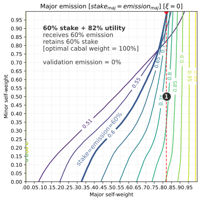
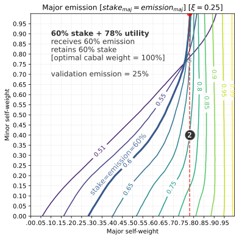
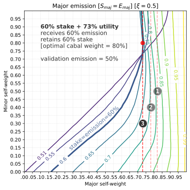

We set validation reward ratio at $\xi=0$, $0.25$, and $0.5$ and respectively observe 82%, 78%, 73% honest utility requirement for 60% honest stake preservation.
This means that network security improves as the validation reward ratio is increased, although a significant server incentive ratio still needs to be maintained to ensure overall high utility.